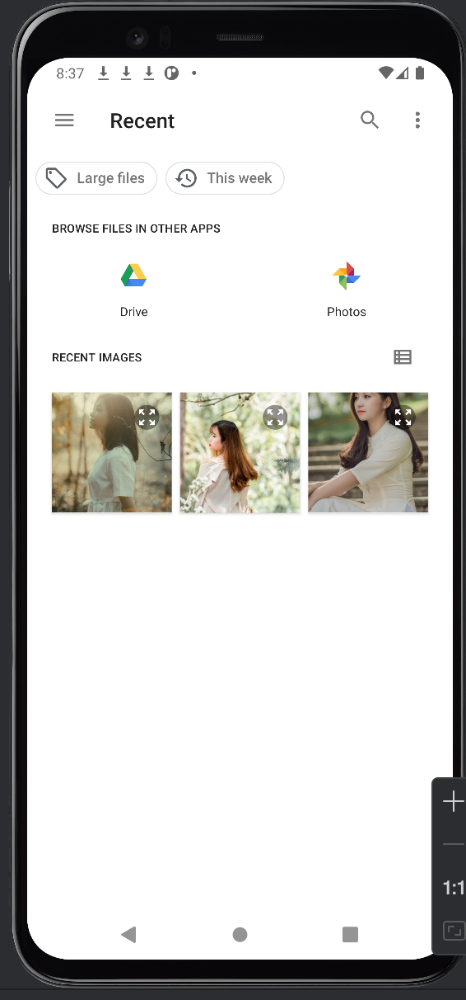
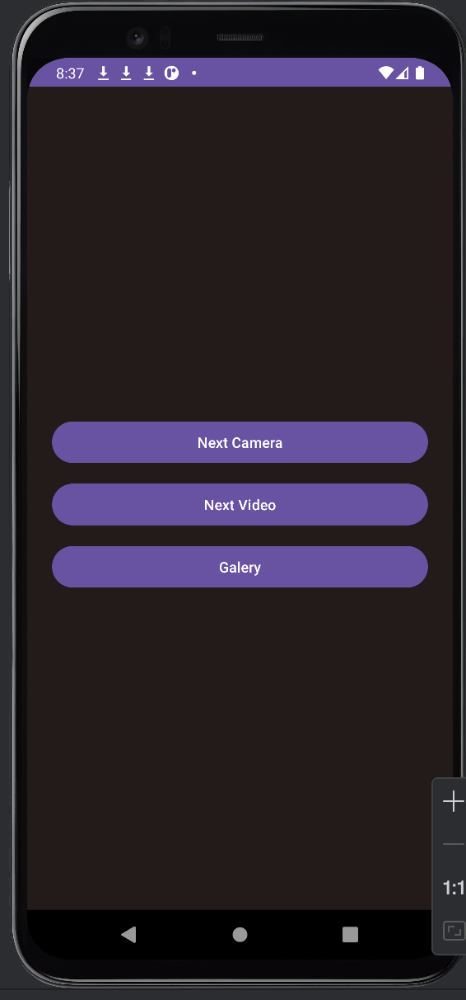
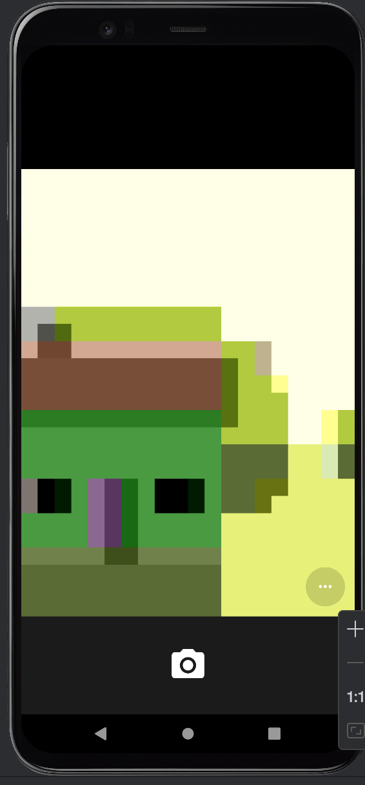
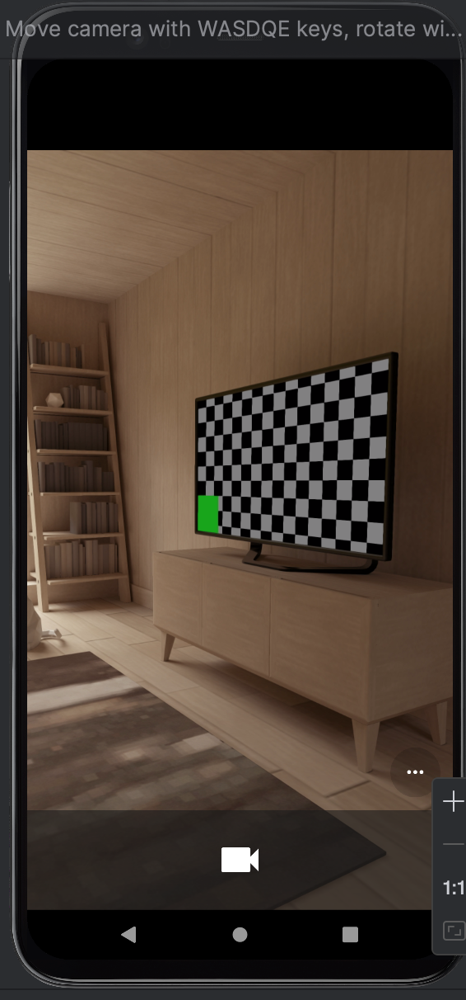
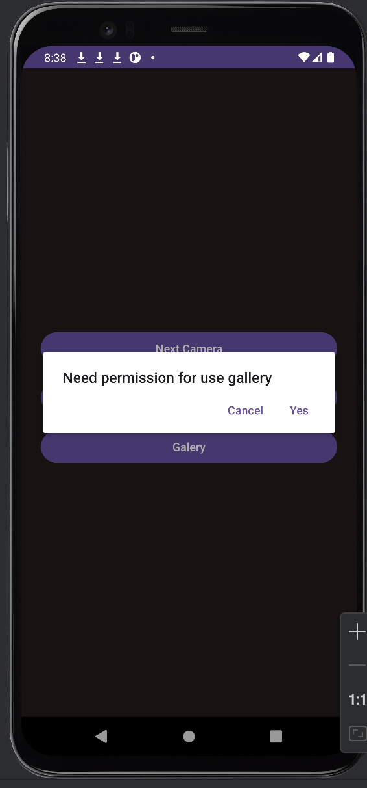

# 📸 Camera & Gallery App

-brightgreen?logo=android&logoColor=white)

> A simple Android app built with Kotlin that demonstrates how to **take photos**, **record videos**, and **select multiple images from the gallery** using modern **Activity Result APIs** and **runtime permissions**.

---

## 🧭 Overview

This project is part of the **FactCampus Android Learning Series (Part 1)**.  
It demonstrates how to:

- Capture photos using the **Camera**
- Record videos using the **Video Recorder**
- Pick multiple images from the **Gallery**
- Request and handle **Android 13+ permissions** (`READ_MEDIA_IMAGES`, `READ_MEDIA_VIDEO`)
- Implement clean and modern **Kotlin** code with **ViewBinding**

---

## 🖼️ Screenshots

  
  
  
  
  
  

> 📱 App screenshots — showing Camera, Video, and Gallery features

---

## 🚀 Features

- 📷 Capture photos with `MediaStore.ACTION_IMAGE_CAPTURE`
- 🎥 Record videos with `MediaStore.INTENT_ACTION_VIDEO_CAMERA`
- 🖼️ Select multiple images using `ActivityResultContracts.GetMultipleContents`
- 🔐 Smart runtime permission handling for all Android versions
- ⚡ Uses `ActivityResultContracts` instead of deprecated `onActivityResult`

---

## 🧰 Tech Stack

| Category | Technology |
|-----------|-------------|
| **Language** | Kotlin |
| **UI** | XML Layout + ViewBinding |
| **Permissions** | AndroidX Core + AlertDialog |
| **SDK** | Min SDK 24 / Target SDK 34 |
| **Build Tools** | Gradle (KTS compatible) |

---

## 🗂️ Project Structure
